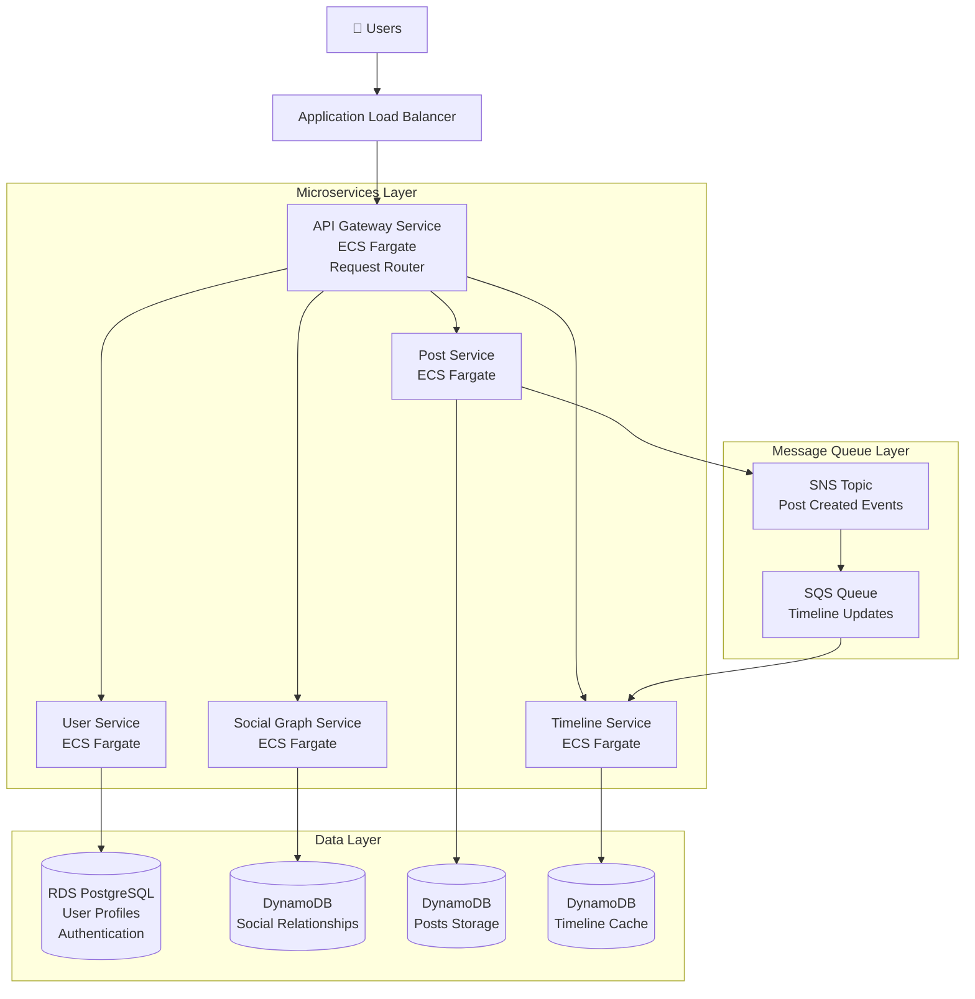

# A Distributed Social Media Platform

[](LICENSE)


## 📖 Table of Contents
- [Project Overview](#project-overview)
- [Why We Built This](#why-we-built-this)
- [System Architecture](#system-architecture)
- [Technology Stack](#technology-stack)
- [Key Features](#key-features)
- [Timeline Fan-out Strategy Experiments](#timeline-fan-out-strategy-experiments)
- [Development Journey](#development-journey)
- [Getting Started](#getting-started)
- [Project Structure](#project-structure)
- [Experiments & Results](#experiments--results)

## 🎯 Project Overview

We built a **production-grade distributed social media platform** that demonstrates scalability, fault tolerance, and performance optimization principles from CS6650 (Building Scalable Distributed Systems). This project showcases real-world distributed systems challenges and solutions, including:

- Microservices architecture with service mesh patterns
- Multiple database technologies optimized for different access patterns
- Asynchronous message processing for write-heavy operations
- Advanced caching strategies for read-heavy workloads
- Infrastructure as Code (IaC) with Terraform
- Performance testing and optimization at scale

## 💡 Why We Built This

Social media platforms present unique distributed systems challenges:

1. **Massive Scale**: Handling millions of users with varying activity patterns
2. **Read-Heavy Workloads**: 90% reads vs 10% writes (timeline retrieval far exceeds posting)
3. **Hot Spot Problem**: Celebrity users with millions of followers create bottlenecks
4. **Real-Time Requirements**: Users expect instant feed updates
5. **Relationship Complexity**: Graph-based social connections require specialized storage

### The Fan-out Problem

The core challenge we explored: **How do you efficiently deliver a post to millions of followers?**

- **Fan-out on Write (Push)**: Pre-compute timelines when posts are created
- **Fan-out on Read (Pull)**: Compute timelines on-demand when users request them
- **Hybrid Approach**: Combine both strategies based on user characteristics

This project implements and rigorously compares all three approaches with real performance data.

## 🏗️ System Architecture

The platform consists of **4 core microservices** designed for independent scaling and deployment:




### Service Responsibilities

| Service | Purpose | Data Store | Communication |
|---------|---------|------------|---------------|
| **User Service** | Authentication, user profiles, account management | PostgreSQL RDS | REST + gRPC |
| **Post Service** | Content creation, storage, retrieval | PostgreSQL RDS | REST + SQS |
| **Social Graph Service** | Follow/unfollow relationships, social connections | AWS Neptune (Graph DB) | REST + gRPC |
| **Timeline Service** | Feed generation, timeline aggregation | DynamoDB | REST |
| **Web Service** | API Gateway, request routing, load balancing | N/A | REST |

## 🛠️ Technology Stack

### Backend Framework
- **Go + Gin**: High-performance HTTP framework with excellent concurrency support
- **gRPC**: Low-latency inter-service communication

### Data Storage
- **PostgreSQL (RDS)**: Relational data for users and posts
- **AWS Neptune**: Graph database optimized for social relationships
- **DynamoDB**: NoSQL for high-throughput timeline storage
- **Redis ElastiCache**: In-memory caching for hot data

### Infrastructure
- **AWS ECS Fargate**: Serverless container orchestration
- **Application Load Balancer (ALB)**: Traffic distribution and health checks
- **Terraform**: Infrastructure as Code for reproducible deployments
- **Docker**: Containerization for consistent environments

### Messaging & Observability
- **Amazon SQS/SNS**: Asynchronous service communication
- **CloudWatch**: Monitoring and logging

## ✨ Key Features

- **Scalable Microservices**: Each service scales independently based on load
- **Multiple Fan-out Strategies**: Push, Pull, and Hybrid timeline generation
- **Graph-based Social Network**: Efficient relationship queries with Neptune
- **Async Processing**: SQS queues handle write-heavy operations without blocking
- **Multi-layer Caching**: Redis reduces database load for hot data
- **Infrastructure as Code**: Complete Terraform modules for reproducible deployments
- **Load Testing Framework**: Locust-based performance testing suite
- **Real-world Data Simulation**: Realistic follower distributions (regular users, influencers, celebrities)

## 🧪 Timeline Fan-out Strategy Experiments

We conducted comprehensive performance experiments comparing three fan-out algorithms:

### Strategies Tested

1. **Push (Fan-out on Write)**: 
   - Timeline pre-computed when post is created
   - Fast reads, slow writes
   - High storage overhead

2. **Pull (Fan-out on Read)**:
   - Timeline computed on-demand
   - Fast writes, slower reads
   - Low storage overhead

3. **Hybrid**:
   - Push for regular users, Pull for celebrities
   - Balanced approach
   - Optimized for real-world distributions

### Experiment Parameters

| Parameter | Values |
|-----------|--------|
| **User Scale** | 5K, 25K, 100K users |
| **Follower Distribution** | Regular (85%): 10-100 followers<br>Influencers (14%): 100-50K followers<br>Celebrities (1%): 50K-500K followers |
| **Read-Write Ratio** | 9:1 (realistic social media traffic) |
| **Concurrent Users** | 20%, 50%, 80% of total users |
| **Test Duration** | 30 minutes (25min steady + 5min burst) |

### Key Metrics

- Post creation latency (P50, P95, P99)
- Timeline generation time
- Database operations count
- Storage overhead
- Throughput scaling
- System resource utilization

### Results Summary

📊 **Full experimental results and analysis**: [View Experiments Wiki](https://github.com/PCBZ/CS6650-Project/wiki/Experiments-Results)

Key findings:
- **Hybrid strategy** provided best overall performance across different user scales
- **Pull strategy** excelled at write throughput but struggled with read latency at scale
- **Push strategy** delivered fastest reads but couldn't handle celebrity user loads
- Caching reduced read latency by **60-80%** across all strategies

## 🚀 Development Journey

### Project Timeline: October 2025 - November 2025

Our distributed social media platform was built over **6 weeks** with **133 commits**, **34 pull requests**, and contributions from **4 team members**. Here's how the project evolved:

#### 📊 Development Activity Overview

```
Oct 18  ██░░░░░░░░░░░░░░░░░░  Initial commit
Nov 5-6 ████████████░░░░░░░░  Foundation & architecture (17 commits)
Nov 7-8 ████████████████████  Core services development (52 commits)
Nov 9-11████████████████░░░░  Service integration & testing (39 commits)
Nov 12+ ██████░░░░░░░░░░░░░░  Experiments & optimization (25 commits)
```

**Peak Development Day**: November 8, 2025 - 35 commits (Infrastructure week!)

### Phase 1: Foundation & Planning (Oct 18 - Nov 5)
**Commits: 1-4 | Branch: `main`**

- ✅ **Oct 18**: Initial commit - Project kickoff
- ✅ **Nov 5**: User Service foundation established
  - PostgreSQL schema design
  - Basic authentication endpoints
  - Docker containerization setup

**Key Commits:**
- `afde285` - Initial commit
- `3552785` - User service implementation
- `1cd4c51` - Fixed existing issues in user service

### Phase 2: Core Services Development (Nov 6-8)
**Commits: 5-56 | Branches: `feature/user-service`, `feature/timeline_service`, `feature/post_service`**

This was our most intensive development period with **52 commits in 3 days**!

#### User Service (Nov 6-7)
- ✅ Implemented gRPC communication layer
- ✅ Fixed Docker credential storage issues
- ✅ Configured RDS PostgreSQL integration
- ✅ **PR #3, #6**: User service merge to main

**Key Commits:**
- `b5533aa` - gRPC configuration changes
- `9cc4705` - Fixed Docker credential storage issue
- `047e19f` - Fixed Docker image creation problem

#### Timeline Service (Nov 6-8)
- ✅ Created DynamoDB schema for timeline storage
- ✅ Implemented timeline service with fan-out logic
- ✅ Added request redirection support
- ✅ Integrated with user service via gRPC
- ✅ **PR #4, #5, #9, #10**: Timeline service iterations

**Key Commits:**
- `4898aa1` - Added DynamoDB integration
- `351fce5` - Timeline service feature complete
- `8b73711` - Added timeline service to API gateway
- `6218816` - Transplanted gRPC to production endpoints

#### Post Service (Nov 7-8)
- ✅ Post creation and retrieval APIs
- ✅ SQS integration for async processing
- ✅ Protocol Buffer definitions
- ✅ **PR #7, #11**: Post service integration

**Key Commits:**
- `c98f2b8` - Post service initialization
- `5257d0f` - Put proto in root path, added post service to gateway
- `53aafd9` - Terraform refactor for post service

### Phase 3: Infrastructure & Service Mesh (Nov 8-10)
**Commits: 57-90 | Branches: `feature/social-graph-service`, `refactor/*`**

#### Social Graph Service with Neptune (Nov 8-9)
- ✅ AWS Neptune graph database setup
- ✅ Follow/unfollow relationship management
- ✅ gRPC test endpoints with graceful degradation
- ✅ Load data scripts for realistic social graphs
- ✅ **PR #21**: Social graph service merge

**Key Commits:**
- `c365d9b` - Moved proto to root directory
- `1df97c4` - Added gRPC endpoints to Terraform outputs
- `27af6d4` - Load data script for graph population
- `6e80038` - Added gRPC test endpoint and graceful degradation
- `a477bbf` - Added comprehensive tests

#### Infrastructure as Code (Nov 9-10)
- ✅ Terraform modules for ALB, IAM, Network, RDS
- ✅ ECS Fargate deployment configurations
- ✅ Service mesh with AWS Cloud Map
- ✅ **PR #22, #23**: Infrastructure integration

**Key Commits:**
- `b16222c` - Updated RPC configuration
- `732e927` - Set gRPC connection between services
- `34d502d` - Moved hybrid threshold to environment variables

### Phase 4: Fan-out Strategy Implementation (Nov 10-12)
**Commits: 91-105 | Branches: `feature/timeline_service`, `refactor/post-service-test`**

#### Push, Pull, and Hybrid Modes (Nov 10-12)
- ✅ Implemented fan-out on write (Push)
- ✅ Implemented fan-out on read (Pull)
- ✅ Hybrid strategy with celebrity threshold
- ✅ DynamoDB field type compatibility fixes
- ✅ **PR #24-30**: Multiple iterations and refinements

**Key Commits:**
- `58984a1` - Resolved timeline-service launch failures
- `684ecc6` - Set RPC connection for timeline service
- `889d411` - Modified DynamoDB field types for compatibility
- `5e4fcfb` - Added dependency on web service for connections
- `3a78fdd` - Aligned hybrid threshold across services
- `cfbef14` - Added 5K push mode test results
- `3ec0828` - Added pull mode test results

### Phase 5: Performance Testing & Experiments (Nov 18-26)
**Commits: 106-128 | Branch: `experiments/timeline_retrieval`**

#### Comprehensive Load Testing (Nov 18-26)
- ✅ Generated realistic test data (5K, 25K, 100K users)
- ✅ Implemented Locust load testing framework
- ✅ Follower distribution simulation (regular/influencers/celebrities)
- ✅ Collected performance metrics across all strategies
- ✅ **PR #31**: Experiments merge with results

**Key Commits:**
- `43161f8` - Generating users and their following distributions
- `8387d69` - Added timeline retrieval tests
- `87ef15b` - Added timeline push test results
- `06c1189` - Added test results for multiple configurations
- `3d3f2fd` - Added concurrent load for post service
- `bcbfde2` - Adjusted DynamoDB settings for performance
- `709eb8b` - Set up for 25K user scale tests
- `70fac59` - Added hybrid mode results
- `9bcc088` - Compiled all test results

**Test Reports Generated:**
- Push mode: 10, 100 followings per user
- Pull mode: 10, 100 followings per user
- Hybrid mode: Multiple scales and configurations

### Phase 6: Storage & Consistency Analysis (Nov 27-29)
**Commits: 129-133 | Branches: `feature/user-service`, `test/post-consistency`**

#### Storage Experiments (Nov 27)
- ✅ Storage overhead comparison across strategies
- ✅ Visualization scripts for data analysis
- ✅ Cost-benefit analysis
- ✅ **PR #32**: Storage experiments

**Key Commits:**
- `950afb8` - Storage experiments implementation

#### Consistency Testing (Nov 28-29)
- ✅ Post inconsistency detection tests
- ✅ Eventual consistency verification
- ✅ Race condition analysis
- ✅ **PR #33, #34**: Results and consistency tests

**Key Commits:**
- `6c0f2a0` - Added results from consistency tests
- `750dc7e` - Added posts inconsistency test
- `e101bec` - Final merge of consistency testing

### 👥 Team Contributions

| Contributor | Commits | Primary Focus |
|-------------|---------|---------------|
| **PCBZ** | 75 | Timeline Service, Experiments, Infrastructure |
| **yixu9** | 20 | Architecture, Service Integration |
| **Bijing Tang** | 15 | Pull Request Management, Post Service |
| **nagi0310** | 9 | Post Service, Terraform, Testing |
| **zhixiaowu** | 9 | User Service, Docker, Configuration |

### 🌳 Branch Strategy

We followed a **feature branch workflow** with the following key branches:

- `main` - Production-ready code (protected)
- `feature/user-service` - User authentication & profiles
- `feature/post-service` - Content management
- `feature/timeline-service` - Feed generation & fan-out strategies
- `feature/social-graph-service` - Relationship management
- `experiments/timeline_retrieval` - Performance testing
- `test/post-consistency` - Consistency validation
- `refactor/*` - Code improvements and optimization

**Total Branches Created**: 14 feature branches
**Pull Requests Merged**: 34 PRs with code reviews

### 📈 Development Velocity

```
Week 1 (Oct 18-25):  █░░░░░░░░░  Planning & setup
Week 2 (Nov 5-11):   ██████████  Core development (87 commits!)
Week 3 (Nov 12-18):  ███░░░░░░░  Testing & refinement
Week 4 (Nov 19-26):  █████░░░░░  Performance experiments
Week 5 (Nov 27-29):  ███░░░░░░░  Analysis & documentation
```

### 🔄 Continuous Integration Highlights

- **34 Pull Requests** - All reviewed and merged
- **14 Feature Branches** - Parallel development streams
- **133 Commits** - Incremental, tested changes
- **Multiple Deployments** - Terraform apply iterations
- **Test Coverage** - Locust load tests, consistency tests, storage experiments

### 🎯 Key Milestones Achieved

| Date | Milestone | Significance |
|------|-----------|--------------|
| **Oct 18** | 🎬 Project Started | Initial repository setup |
| **Nov 6** | 🏗️ First Service Deployed | User Service live on ECS |
| **Nov 8** | 🚀 All Services Running | Complete microservices architecture |
| **Nov 10** | 🔄 Fan-out Implemented | All three strategies working |
| **Nov 12** | 📊 First Load Tests | Pull mode baseline established |
| **Nov 25** | 🎉 Experiments Complete | Full performance comparison done |
| **Nov 29** | ✅ Final Results | Consistency tests & documentation |

### 🛠️ Technical Challenges Overcome

Throughout development, we tackled several complex issues:

1. **Docker Credential Storage** (Nov 7) - Fixed authentication issues for ECR
2. **DynamoDB Type Compatibility** (Nov 11) - Aligned protobuf with DynamoDB schemas
3. **gRPC Service Discovery** (Nov 9-10) - Implemented service mesh communication
4. **Timeline Launch Failures** (Nov 10) - Resolved deployment configuration issues
5. **Celebrity User Bottleneck** (Nov 11) - Implemented hybrid fan-out strategy
6. **Performance Optimization** (Nov 22-23) - Tuned DynamoDB read/write capacity
7. **Test Data Generation** (Nov 18) - Created realistic follower distributions

## 🏁 Getting Started

### Prerequisites

- Go 1.21+
- Docker & Docker Compose
- Terraform 1.5+
- AWS CLI configured
- Python 3.9+ (for testing scripts)

### Quick Start

1. **Clone the repository**
```bash
git clone https://github.com/PCBZ/CS6650-Project.git
cd CS6650-Project
```

2. **Install dependencies**
```bash
# Install Go dependencies for each service
cd services/user-service && go mod download
cd ../post-service && go mod download
cd ../social-graph-services && go mod download
cd ../timeline-service && go mod download
```

3. **Deploy infrastructure**
```bash
cd terraform
terraform init
terraform plan
terraform apply
```

4. **Run services locally (development)**
```bash
# Each service can be run independently
cd services/user-service
go run main.go

# Or use Docker Compose
docker-compose up
```

5. **Run load tests**
```bash
cd tests/timeline_retrieval
pip install -r requirements.txt
locust -f locust_timeline_retrieve.py
```

### Configuration

Each service has its own `terraform.tfvars` for environment-specific configuration. See individual service READMEs for details:
- [User Service README](services/user-service/README.md)
- [Social Graph Service README](services/social-graph-services/README.md)
- [gRPC Test Client README](grpc-test-client/README.md)

## 📁 Project Structure

```
CS6650-Project/
├── services/              # Microservices implementation
│   ├── user-service/      # User authentication & profiles
│   ├── post-service/      # Content management
│   ├── social-graph-services/  # Relationship management
│   └── timeline-service/  # Feed generation
├── proto/                 # Protocol Buffer definitions
├── terraform/             # Infrastructure as Code
│   └── modules/           # Reusable Terraform modules
│       ├── alb/           # Load balancer configuration
│       ├── iam/           # IAM roles and policies
│       ├── network/       # VPC, subnets, security groups
│       ├── rds/           # PostgreSQL database
│       └── service/       # ECS service module
├── tests/                 # Load testing and experiments
│   ├── timeline_retrieval/     # Fan-out strategy tests
│   ├── storage-experiment/     # Storage overhead analysis
│   └── post-inconsistency/     # Consistency testing
├── scripts/               # Utility scripts
└── web-service/           # API Gateway
```

## 📊 Experiments & Results

### Available Test Suites

1. **Timeline Retrieval Performance** (`tests/timeline_retrieval/`)
   - Compare push vs pull vs hybrid strategies
   - Measure latency under various loads
   - Test with realistic follower distributions

2. **Storage Overhead Analysis** (`tests/storage-experiment/`)
   - Measure storage requirements for each strategy
   - Compare database size growth over time
   - Analyze cost implications

3. **Post Consistency Testing** (`tests/post-inconsistency/`)
   - Verify eventual consistency guarantees
   - Test race conditions
   - Measure consistency convergence time

### Running Experiments

```bash
# Timeline retrieval test (Push mode)
cd tests/timeline_retrieval
locust -f locust_timeline_retrieve.py --headless -u 1000 -r 100 -t 30m

# Storage experiment
cd tests/storage-experiment
./run_storage_experiment.sh

# Consistency test
cd tests/post-inconsistency
python consistency_test.py
```

### Results & Analysis

📈 Detailed experiment results, graphs, and analysis are available in our [Wiki](https://github.com/PCBZ/CS6650-Project/wiki/Experiments-Results)

Key artifacts:
- Performance comparison reports (HTML)
- Latency distribution graphs
- Storage growth visualizations
- Throughput scaling charts
- Cost analysis spreadsheets

## 🤝 Contributing

This is an academic project for CS6650. For questions or suggestions, please open an issue.

## 📄 License

This project is licensed under the MIT License - see the [LICENSE](LICENSE) file for details.

## 🙏 Acknowledgments

- CS6650 course staff for guidance on distributed systems principles
- AWS for providing cloud infrastructure
- Open source communities for excellent tools and libraries

---

**Built with ❤️ for CS6650 - Building Scalable Distributed Systems**